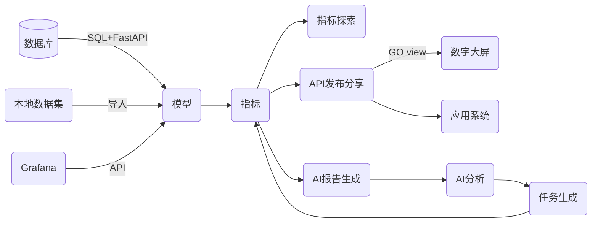

## **简介**

`MetricBoost` 是一个指标管理系统，旨在帮助企业高效地管理和分析各类业务指标，提升决策效率和数据价值。

`MetricBoost` 想要：

V1

- 更好展示数据开发人员所产出的指标，可以自定义的对指标进行钻取、探索分析；
- 可以将指标进行发布及分享，作为数据服务的核心，对接其他的应用系统；
- 对指标进行监控预警，并可以发送到飞书、企业微信、邮箱等；
- 借助 `大模型` 的能力，从指标的数据中产出文档的报告；
- 借助 `大模型` 的能力，从报告中进行分析数据所展现的问题或者现象，然后进行任务建议；

V2

- 可以从系统上直接进行任务的流转，或者同步到其他的OA系统上进行流转；
- 制作小程序，实现多端同步，便携查看指标的情况；
- 支持上传 excel 的数据文件进行建模分析；

V ...

## **特性**

### **核心功能**

#### 🎯 **高级指标探索与分析**

* **交互式数据探索** ：提供拖拽式的交互操作，支持自定义多维度、多指标的深度钻取和切片分析。
* **动态仪表盘** ：创建个性化的动态仪表盘，实时展示关键业务指标。
* **自定义报告** ：支持自定义报告模板，满足不同业务场景的需求。

#### 🚀 **指标发布与共享**

* **一键发布** ：将指标和分析结果一键发布，作为数据服务核心，供其他应用系统调用。
* **权限控制** ：精细化的权限管理，确保数据安全共享。
* **协同合作** ：支持团队协作，评论和讨论功能促进团队交流。

#### 🔔 **实时监控与预警**

* **实时数据监控** ：7×24 小时不间断监控关键指标，保障业务稳定运行。
* **智能预警机制** ：支持设置复杂的预警规则，异常情况及时通知相关人员。
* **多渠道通知** ：预警信息可通过飞书、企业微信、邮件、短信等多种渠道发送。

#### 🧠 **AI 驱动的分析与报告**

* **智能报告生成** ：借助大模型，自动从指标数据中生成专业的分析报告。
* **自然语言问答** ：支持以自然语言与系统交互，快速获取所需信息。
* **智能决策建议** ：基于数据分析结果，提供优化建议和行动方案。

### **创新功能**

#### 🔄 **任务流转与集成**

* **内置任务管理** ：在系统中直接创建、分配和跟踪任务，提高工作效率。
* **OA 系统集成** ：与企业现有的 OA 系统无缝对接，实现流程统一。
* **通知与提醒** ：任务进展实时更新，重要事项不再错过。

#### 📱 **多端同步与移动支持**

* **跨平台访问** ：支持 PC、移动端、小程序等多种形式，随时随地查看指标。
* **实时同步** ：数据和设置在各端实时同步，保持工作连续性。
* **离线访问** ：支持离线模式，在无网络环境下也能查看关键数据。

#### 📊 **外部数据建模与分析**

* **快捷数据导入** ：支持导入 Excel 等多种格式的数据文件，快速开始分析。
* **自动化数据处理** ：智能识别数据结构，自动完成清洗和预处理。
* **模型应用** ：提供丰富的统计和机器学习模型，满足高级分析需求。

### **技术优势**

#### 💡 **现代化技术架构**

* **后端** ：基于 Python 的 FastAPI 构建，轻量高效，支持异步处理，高并发性能优越。
* **前端** ：采用 Vue3 和 TypeScript，模块化开发，提升代码质量和可维护性。

#### 🔒 **安全与合规**

* **数据加密** ：传输与存储全程加密，保障数据安全。
* **权限体系** ：多层级权限控制，确保数据访问合规。
* **审计日志** ：详细记录操作日志，满足企业审计需求。

#### 🌐 **开放与扩展**

* **API 优先** ：提供全面的 RESTful API，方便二次开发和系统集成。
* **插件机制** ：支持插件扩展，满足个性化需求。
* **微服务架构** ：模块解耦，方便功能扩展和系统维护。

### **用户价值**

#### ⚡ **提升决策效率**

* **即时洞察** ：快速获取关键指标，辅助决策层做出明智选择。
* **数据驱动** ：用数据说话，告别拍脑袋决策。

#### 🤝 **促进团队协作**

* **信息共享** ：打破数据孤岛，实现跨部门的信息共享与协作。
* **知识沉淀** ：累计分析报告和决策记录，成为企业宝贵的知识资产。

#### 📈 **推动业务增长**

* **发现商机** ：通过数据分析挖掘潜在的业务机会。
* **优化运营** ：及时发现问题，持续改进，提升运营效率。

## 流程



## **启动方式**

### **数据库启动**

```powershell
docker run -d --name mysql -p 5260:3306 -v ${PWD}/mysql/conf.d:/etc/mysql/conf.d -v ${PWD}/mysql/logs:/logs -v ${PWD}/mysql/data:/var/lib/mysql -e MYSQL_ROOT_PASSWORD=123456 -e TZ=Asia/Shanghai mysql:9.0

```

### **后端启动**
